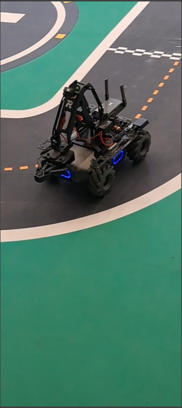
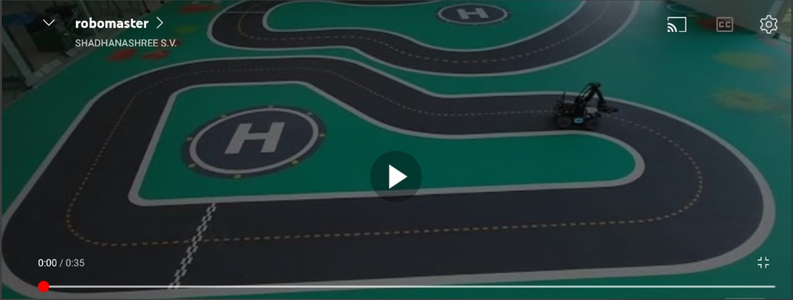

# MobileRobot-Openloopcontrol
## Aim:

To develop a python control code to move the mobilerobot along the predefined path.

## Equipments Required:
1. RoboMaster EP core
2. Python 3.7

## Procedure

Step1:

Start the program.

Step2:

Get the values from the robomaster .

Step3:

Run the program for your values to check.

Step4:

Run the value by using different commands.

Step5:

End the program

## Program
```python
from robomaster import robot
import time
from robomaster import camera

if _name_ == '_main_':
    ep_robot = robot.Robot()
    ep_robot.initialize(conn_type="ap")

    ep_chassis = ep_robot.chassis
    ep_led = ep_robot.led
    ep_camera = ep_robot.camera

    print("Video streaming started.....")
    ep_camera.start_video_stream(display=True, resolution = camera.STREAM_360P)

    ep_chassis.move(x=0.55, y=0, z=0, xy_speed=1.2).wait_for_completed()
    ep_led.set_led(comp = "all",r=0,g=0,b=255,effect="on")

    ep_chassis.move(x=0, y=0, z=-80, xy_speed=1.5).wait_for_completed()
    ep_led.set_led(comp = "all",r=153,g=51,b=102,effect="on") 
    
    ep_chassis.move(x=2.15, y=0, z=0, xy_speed=1.3).wait_for_completed()
    ep_led.set_led(comp = "all",r=102,g=0,b=102,effect="on") 

    ep_chassis.move(x=0, y=0, z=-6, xy_speed=0).wait_for_completed()
    ep_led.set_led(comp = "all",r=0,g=255,b=0,effect="on") 
   
    ep_chassis.move(x=0, y=1.5, z=0, xy_speed=1.3).wait_for_completed()
    ep_led.set_led(comp = "all",r=153,g=51,b=102,effect="on")

    ep_chassis.move(x=0, y=0, z=35, xy_speed=1.3).wait_for_completed()
    ep_led.set_led(comp = "all",r=255,g=0,b=102,effect="on")

    ep_chassis.move(x=-1.15, y=0, z=0, xy_speed=1.3).wait_for_completed()
    ep_led.set_led(comp = "all",r=255,g=102,b=0,effect="on")
    
    ep_chassis.move(x=0, y=0, z=-140, xy_speed=1.3).wait_for_completed()
    ep_led.set_led(comp = "all",r=0,g=128,b=128,effect="on")

    ep_chassis.move(x=1.35, y=0, z=0, xy_speed=1.3).wait_for_completed()
    ep_led.set_led(comp = "all",r=0,g=255,b=255,effect="on")


    ep_chassis.move(x=0.4, y=0, z=-75, xy_speed=1.3).wait_for_completed()
    ep_led.set_led(comp = "all",r=0,g=204,b=255,effect="on")

    ep_chassis.move(x=0.9, y=0, z=0, xy_speed=1.3).wait_for_completed()
    ep_led.set_led(comp = "all",r=51,g=51,b=51,effect="on")

    ep_chassis.move(x=0, y=0, z=-93, xy_speed=1.3).wait_for_completed()
    ep_led.set_led(comp = "all",r=0,g=204,b=255,effect="on")

    ep_chassis.move(x=2.78, y=0, z=0, xy_speed=1.3).wait_for_completed()
    ep_led.set_led(comp = "all",r=255,g=255,b=255,effect="on")

    ep_chassis.move(x=0, y=0, z=0, xy_speed=1.3).wait_for_completed()
    ep_led.set_led(comp = "all",r=204,g=153,b=255,effect="on")
    time.sleep(4)
    ep_camera.stop_video_stream()
    print("Stopped video streaming.....")

    ep_robot.close()
```

## MobileRobot Movement Image:


## OUTPUT:



## MobileRobot Movement Video:
(https://img.youtube.com/vi/https://youtu.be/BVjvmbwNWxc?si=cjNxnapBef4mgWqX/0.jpg)
(https://www.youtube.com/watch?v=https://youtu.be/BVjvmbwNWxc?si=cjNxnapBef4mgWqX)



## Result:
Thus the python program code is developed to move the mobilerobot in the predefined path.


```
Mobile Robotics Laboratory
Department of Artificial Intelligence and Data Science/ Machine Learning
Saveetha Engineering College
```
